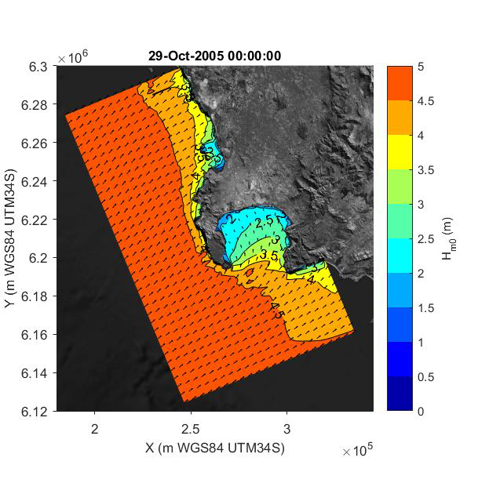

\newpage
## Introduction

Kelps are a group of large seaweeds of the order Laminariales (Ochrophyta), which despite their relatively low taxonomic diversity of species in genera [@Bolton2010], nevertheless form the basis of one of the most productive ecosystems globally [@Mann1973]. Kelps generally have a dependence on cool, temperate and arctic seawater temperatures [@Santelices2007; @Bolton2010], and dominate the nearshore biomass within the rocky shallow coasts in both hemispheres [@Steneck2002]. Outside of these latitudes, they are also found in cool, deep water towards the tropics [@Graham2007]: this deeper tropical water, due to its water clarity, also allows for suitable photon flux and a nitrate concentration [@Luning1990; @Dayton1999; @Zimmerman1984], the two other environmental variables that support kelp productivity. Although kelps have a low taxonomic diversity, their size and complex morphology provide a heterogeneous habitat structure [@Steneck2002] that accommodate a multitude other turf and subcanopy seaweed species, and diverse assemblages of sessile and mobile invertebrates and vertebrates [@Mann1973; @Duggins1989; @Steneck2002], each depending on a wide suite of ecological services provided by the kelp habitat [@Gaines1987; @Bologna1993; @Levin1994; @Anderson1997].

### Background

Kelps are sessile species and have to adapt to local environmental conditions in order to persist and survive. The resilience of kelps is evident through their distribution, which spans a range of environmental conditions that vary spatially and temporally. Wave exposure and temperature are regarded as important environmental drivers with regards to macroalgae, and play a role in the distribution, abundance, diversity, composition, growth [@Cousens1982] and productivity [@pedersen2012a] of kelps. Wave exposure is recognised as the main cause of kelp mortality, which may manifest itself through dislodgment of individuals or breakage of important morphological structures. These mechanisms usually occur during times of high wave energy or pulse disturbance events, such as storms.Mechanical forces generated by the hydrodynamic environment, in the form of sudden strong ocean currents or storms, between 10- 20 m s-1 with accelerations of 400 m s-2 [@Friedland1995] are the biggest threat to kelp survival. 
Kelps are able to reduce the probability of dislodgment or breakage through morphological adaptation, which may involve several strategies. Kelps can either reduce drag, increase attachment strength or increase flexibility in order to survive high wave energy environments.The strategy that the algal organism employs is dependent on the species. For instance, branched, articulated algae will vary its morphology differently to that of foliose, more flexible macroalgae. For example, @moss1948 investigated the anatomy, chemical composition of *Fucus spiralis* at three sites that varied in wave exposure (sheltered, medium exposure and exposed). The authors found that individuals in exposed sites showed less branching of thalli as well as variation physiological components, such as organic nitrogen, mannitol, laminarian and alginic acid concentrations. The authors also noted a ‘crumpling effect’ displayed by individuals from exposed sites and inferred that this strategy may reduce overall drag.  Other studies show that macroalgae in wave exposed environments have morphologies that reduce overall drag, increase strength of attachment or increase flexibility. For example, a study by @FowlerWalker2006 tested for differences in morphology of *Ecklonia radiata* between wave-sheltered and wave-exposed sites and through a combination of *in situ* sampling and transplantation of juvenile plants. The results showed that morphology differed between wave-sheltered and wave-exposed sites (thin thallus at sheltered sites and a narrow, thick thallus with a thick stipe at exposed sites), and was consistent with previous studies. Juveniles transplanted into wave exposed sites under went rapid morphological adaptation, whilst the opposite was true for wave-sheltered sites which showed slower morphological adaptation. Dislodgement through increased wave exposure is not the only hydrological parameter playing a role in kelp mortality. A study by @DeBettignies2013 tested if there is a linked between orbital water velocity representative of wave-swept reefs and the morphology and biomass of *Ecklonia radiata*. The results showed that morphological adaptation through drag reduction and strength increase strategies do not reduce drag as efficiently as reduction in overall biomass through reduction in thallus surface area. The authors concluded that at peak orbitat water velocities size (biomass) and not morphological adaptation was the main driver of hydrological performance in wave-swept environments. 

There is also evidence that morphological adaptation is driven by currents, and in fact may be driving hydrological performance of macrolgae. @Duggins2003 examined the direct and indirect flow effects on population dynamics, morphology and biomechanics of several understorey macroalgae species. These species included *Costaria costata*, *Agarum fimbriatum*, and *Laminaria complanata* and * Nereocystis luetkeana*. The results showed that in wave impacted sites (wave exposed) had higher rates of mortality, and no significance was found between survival of individuals and tidal or current velocity. The authors concluded that although tidal and current velocity did not play a significant role in determining kelp survival, it did play a role in morphological adaptation. The results from this study suggest that high current and tidal stresses are the main driver of kelp morphological adaptation. This in turn make those individuals more resilient to dislodgement to wave exposure. Wave exposure is stochastic in nature compared to tidal and ocean currents which are more regular in their frequency and magnitude. Therefore the regular forces of tidal and ocean currents may make kelp individuals more resilient to mechanical dislodgement over time. 


### The South African context

The biogeographic distribution of kelp is limited by seawater temperature [@Bolton2010], where increasing temperature gradients reduce kelp distribution. Due to this limiting factor, the two main species of kelps in southern African waters, _Ecklonia maxima_ and _Laminaria pallida_, are distributed along a section of the south coast from De Hoop, extending west around the Cape Peninsula, and thriving north into Namibia [@Molloy1996; @Stegenga1997]. This distribution follows a temperate gradient, where sea temperatures increase as one moves south from Namibia, around Cape Point and towards De Hoop. Although the two species occur together for the majority of the coast, their basic morphologies and resource needs vary to a degree. The larger species, _Ecklonia maxima_, is distributed from Lüderitz to Cape Agulhas (Fig. 1) [@Bolton1985a; @Probyn1985; @Bolton1987; @Bolton2012].

```{r, echo= FALSE, message=FALSE, warning=FALSE, fig.cap="A map indicating the sites where morphometric measurements were collected for _Ecklonia maxima_ and _Laminaria pallida_.", fig.height=8, fig.width=12}

library(tidyverse)
library(vegan)
library(RColorBrewer)
library(gridExtra)
library(lubridate)
library(GGally)
library(ggpubr)
library(ggrepel)


# Load map data
load("maps/south_africa_coast.Rdata")
load("maps/sa_provinces.Rdata")
load("maps/site_list.Rdata")


# remove De Hoop
kelp_sites <- read_csv("metadata/sites_complete.csv")
kelp_sites_map <- subset(kelp_sites, !site == "De Hoop")

# Subset into 4 regions
west__up_site <- subset(kelp_sites, site == "St Helena Bay" | site == "Sea Point" 
                    | site == "Oudekraal" | site == "Hout Bay")

west__down_site <- subset(kelp_sites, site == "Soetwater" | site == "Olifantsbos" | site == "Scarborough" | site == "Kommetjie")

east_up_site <- subset(kelp_sites, site == "Roman Rock" | site == "A-Frame" | site == "Miller's Point" | site == "Baboon Rock" | site == "Kalk Bay")

east_down_site <- subset(kelp_sites, site == "Batsata Rock" | site == "Bordjies Deep" | site == "Buffelsbaai South" 
                         | site == "Buffelsbaai" | site == "Betty's Bay")

# plot map
ggplot(data = kelp_sites_map, aes(x = lon, y = lat)) +
  geom_polygon(data = south_africa_coast, aes(group = group), fill = "grey70") +
  geom_path(data = sa_provinces, aes(group = group)) +
  geom_point(data = kelp_sites_map)  +
  coord_fixed(xlim = c(17.65, 19.5), ylim = c(-32.75, -34.6)) +
  geom_label_repel(data = west__up_site, aes(x = lon, y = lat, label = site), 
                   size = 3, box.padding = 0.5, nudge_x = -0.5, nudge_y = 0.2, segment.alpha = 0.4) +
  geom_label_repel(data = west__down_site, aes(x = lon, y = lat, label = site), 
                   size = 3, box.padding = 0.5, nudge_x = -0.5, nudge_y = -0.2, segment.alpha = 0.4) +
  geom_label_repel(data = east_up_site, aes(x = lon, y = lat, label = site), 
                   size = 3, box.padding = 0.5, nudge_x = 0.5, nudge_y = 0.3, segment.alpha = 0.4) +
  geom_label_repel(data = east_down_site, aes(x = lon, y = lat, label = site), 
                   size = 3, box.padding = 0.5, nudge_x = 0.35, nudge_y = -0.15, segment.alpha = 0.4) +
  theme(axis.title = element_blank(),
        axis.ticks = element_blank(),
        axis.text = element_blank())

```

Characterised by a large distal swollen bulb filled with gas, and smooth fronds, this species grows to approximately 10 meters [@Bolton1987]. There was, however, a 17-meter specimen collected in 2015 off Cape Point (Smit, unpubl. data).This species of kelp not only dominate the biomass of the South African nearshore, but plays an important ecological role [@Bustamante1996]. The estimated productivity of _Ecklonia maxima_ within South Africa varies between 350 and 1500g Cm-2yr-1 [@Mann1982]. Across the majority of the coastline, _Laminaria pallida_ remains a subsurface kelp, dominating the kelp biomass at depths greater than 10 meters [@Field1980b; @Bolton1987; @Molloy1996]. This species is distributed from Danger Point, east of the Cape Peninsula, to Rocky Point in northern Namibia, and reaches depths of greater than 20 meters [@Field1980b; @Molloy1996; @Molloy1996; @Stegenga1997]. Towards the north along the west coast, from around Hondeklipbaai, _Laminaria pallida_ replaces _Ecklonia maxima_ as the dominant kelp species [@Velimirov1977; @Stegenga1997] and it also occupies increasingly shallower subtidal regions. The northern populations also exhibit an increase in stipe hollowness, compared to the solid stipe morphs in the species’ southern distributions [@Molloy1996]. This variation in morphology was thought to represent two distinct species, with the northern populations formerly described as _Laminaria schinzii_ Foslie [@Molloy1996]. Genetic work has subsequently shown that the two morphs are in fact the same species [@Rothman2017]. In southern African waters, the primary production of _Laminaria pallida_ is between 120 and 1900g C m2yr1, similar to that of _Ecklonia maxima_ [@Mann1982]. Primary production is not the only pathway.

The aim of this study is, therefore, to understand how environmental drivers such as temperature and wave energy can influence morphoplasticity in two species of kelps around South Africa. This will be achieved by initially understanding the variation in abiotic parameters, and morphometrics of _Ecklonia maxima_ and _Laminaria pallida_, around the Western Cape coast. Thereafter we will look at how the abiotic parameters both correlate and influence each other in the nearshore environment of our study region. Finally, we will investigate which abiotic parameters best describe the morphological variation of the two kelp species, using statistical tools. It is predicted that higher wave energy environments will exhibit kelps with reduced undulations, possessing strap-like blades, opposed to low flow regimes that will show greater undulations in frond morphology. An increase in temperature is predicted to influence specific morphological traits that rely on nutrient uptake, as temperature and nutrients share an inverse relationship. An increase in temperature is also predicted to reduce the dominance of the colder water kelp, _Laminaria pallida_, at depth, with a total absence of _Laminaria pallida_ as one approaches the eastern boundary of sample sites.

### Study area

Due to the Cape Peninsula’s temperate latitude, winter months bring an increased frequency of frontal depressions that originate from the Southern Ocean [@Reason2006]. These low pressures are joined by large swells with increased wave energy. The nearshore environment, with the accompanied biota, therefore experiences high wave energy events, with increased frequency in winter [@Veitch2018]. The large peninsula acts as an obstruction for large south westerly swells, providing decreased wave energy along the west side of False Bay [@Shipley1964]. Conversely, the west coast of Cape Point is battered by these large swells at full force. Multiple sites, therefore, exist where kelps grow in diverse temperature and wave energy climates, in close proximity.

In Figure 2 the total and seasonal wave roses of the directional wave buoy just offshore from Cape Town is given form the years 2000 till end 2017 (the period for which directional wave spectra was available). It is due to the near consistent South-westerly swell waves and the complex orography around the peninsula, that the wave energy distribution around the Cape Peninsula varies significantly over a small geographical area. For details on the seasonality of the wave climate around the Cape peninsula please refer to [@Veitch2018].

```{r echo=FALSE, message=FALSE, warning=FALSE, fig.cap="Wave roses of the Cape Point wave rider buoy situated at 18.29oE, message=FALSE, warning=FALSE, 34.2oS in 70m water depth. (a) total wave record, (b) winter waves and (c) summer waves."}

library(png)
library(grid)
library(gridExtra)

img_twr <-  rasterGrob(as.raster(readPNG("figures/total_wave_rose_2.png")), interpolate = FALSE)
img_wwr <-  rasterGrob(as.raster(readPNG("figures/winter_wave_rose_2.png")), interpolate = FALSE)
img_swr <-  rasterGrob(as.raster(readPNG("figures/summer_wave_rose_2.png")), interpolate = FALSE)

grid.arrange(img_twr, img_wwr,img_swr, ncol = 2, nrow = 2)

```

In Figure 3 the total coastal wave exposure of the Cape Peninsula is given in terms of wave energy (kW per meter wave crest length). These values have been computed using model output from approximately 20 year of simulated nearshore wave conditions. Hindcast global wave parameters were refracted into the nearshore via a spectral phase-averaged numerical wave modelling code SWAN (Simulating, WAves in the Nearshore - 3rd generation). The model is fully spectral in all frequencies and directions (0o -360o) (can solve swell and local wind generated waves simultaneously, propagating in different direction) and was used to model the propagation of short crested swell waves, waves generated by wind, non-linear wave-wave interaction and dissipation and depth induced breaking and refraction. Wave energy dissipation due to bottom friction and whitecapping is also accounted for [@Deltares2014].

Time series output from 1997 till 2013 of this model was then produced at the 7m and 15m depth contour lines. Each nearshore output point thus contained a 17-year timeseries of significant wave heights, peak periods and mean wave directions (with both swell and wind waves). This data set is available on a 500m resolution around most of the South African coastline and on a 200m resolution with False Bay as provided by the South African Department of Environmental Affairs (DEA) and Council for Scientific and Industrial Research (CSIR)(@Theron2014). The total 17-year average energy, for each output location, was then computed using linear wave theory, taking into account deep, intermediate and shallow water wave approximations (based on wave length) for the wave energy [@Holthuijsen2007; @Kasiulis2015; @Foteinis2017] which is a function of wave height and period.

The directional sheltering effect of the Cape Peninsula, against the dominant swell direction, (given in Figure 2) is clear observed in the wave exposures presented in Figure 2. The classification from fully sheltered to extremely exposed is based on the total wave energy upper and lower limits. It should be noted that what is classified as sheltered around the South African coastline (a high energy coastline) might be classified as exposed in other regions of the world [@Norderhaug2012; @Liberti2013; @Sundblad2014]. Kelp and other ecosystems adapt to their typical environmental exposure and thus what is classified as extreme abiotic coastal forcings (temperature, winds, waves and currents) will vary around the world depending on the geographical setting.

From Figure 2 the western periphery of the Cape peninsula is almost continuously producing high coastal wave exposures while the Eastern periphery of the peninsula (western coastline of False Bay) revealed sheltered wave exposures. Here the marked seasonality, with higher energy waves during winter, may be clearly observed once more.

```{r echo=FALSE, message=FALSE, warning=FALSE, paged.print=FALSE, fig.cap="Coastal wave energy exposure around the Cape Peninsula for the (a) total 17-year nearshore wave record, (b) only winter months and (c) only summer months."}

img_we_total <-  rasterGrob(as.raster(readPNG("figures/coastal_we_total.png")), interpolate = FALSE)
img_we_winter <-  rasterGrob(as.raster(readPNG("figures/coastal_we_winter.png")), interpolate = FALSE)
img_we_summer <-  rasterGrob(as.raster(readPNG("figures/coastal_we_summer.png")), interpolate = FALSE)

grid.arrange(img_we_total, img_we_winter,img_we_summer, ncol = 2,nrow = 2)

```

In Figure 3 the propagation of a typical offshore wave spectrum is given as produced from a single time-step in SWAN. Figure 3 is presented to clarify the averaged wave exposure maps presented in Figure 4. Tracing the wave height contours into False Bay its clear why this Bay’s western periphery is predominantly sheltered. It should be mentioned that some of the annual winter frontal depression systems pass the Cape Peninsula from the west to east, resulting in wave propagating towards the continent from much more southerly directions. This results in positive and negative wave exposure anomalies all around the peninsula.

```{r echo=FALSE, message=FALSE, warning=FALSE, paged.print=FALSE, fig.cap="SWAN numerical output for an example typical offshore wave conditions refracting around the Cape Peninsula."}



```

\newpage
## Methods
### Morphometrics collection

Between October 2014 and April 2015, morphological measurements of _Laminaria pallida_ and _Ecklonia maxima_ were collected at 18 sites along the Western Cape coast of South Africa (Fig. 1). Eleven samples were collected per morphology, for each species (Table 1, 2). These varying morphometrics allowed measurements such as weight, length and thickness to be compared between sites. Because the macroalgae differ in morphological features, species-specific morphometrics were included. These sites span across the majority of the south-west coast, in varying thermal and wave energy regimes.

Between February 2017 and Novevember 2018, morphological measurements for _Ecklonia maxima_ individuals in shallow water (<1m) at 5 sites along the Western Cape coast of South Africa were collected. These sites represent a wave gradient moving south along the peninsula and into False Bay. The same morphometric measurements were taken as per the deeper _Ecklonia maxima_, and this allowed comparison between morphological characteristics between deep and shallow individuals. 

```{r, echo= FALSE, message=FALSE, warning=FALSE}
library(knitr)
morph <- read.csv("tables/Morphology table.csv")

colnames(morph) <- c("Morphometric", "Unit measurement")

morph_eck <- morph[(1:10), ]
morph_lam <- morph[(11:19), ]

```
```{r, echo= FALSE, message=FALSE, warning=FALSE}

t1 <- kable(morph_eck, row.names = FALSE, caption = "A list of morphology measurements that were collected to investigate how environmental drivers may influence the morphology of _Ecklonia maxima _. Units for each morphometric are included.")

```
```{r, echo= FALSE, message=FALSE, warning=FALSE}

t2 <- kable(morph_lam, row.names = FALSE, caption = "A list of morphology measurements that were collected to investigate how environmental drivers may influence the morphology of _Laminaria pallida_. Units for each morphometric are included.")

```

### Sites

Sites were chosen to represent an array of morphological differences seen within _Ecklonia maxima_ and _Laminaria pallida_. Sites were also chosen to reflect locations that displayed variable wave and temperature regimes (Fig. 2-5), to allow us to robustly test our hypothesis of environmental drivers influencing kelp morphology. St. Helena Bay and Betty’s Bay constituted the north western and south eastern boundary sites respectively. These sites are roughly 300km apart, and lie within separate marine provinces, as outlined above. The Cape Peninsula provides an interesting topographical boundary that shelters the coast in False Bay. Sites were therefore chosen to represent an array of environments, from offshore reefs (Batsata Rock), to sheltered intertidal zones (Miller’s Point). West of Cape Point, a number of sites were chosen to highlight the presence of upwelling (Oudekraal, Kommetjie), as well as kelps growing in protected bays (Hout Bay). 

### Abiotic parameters

In order to compare abiotic parameters for sites around the coast, large historical databases for both temperature and wave energy were accessed. Shallow water temperatures were sourced from the South African Coastal Temperature Network (SACTN) website (https://github.com/ajsmit/SACTN). Seven different organisations within South Africa contribute to the SACTN, where _in situ_ temperature measurements are made around the South African coast using either hand-held thermometers or digital temperature recorders positioned underwater. The mean duration of the 135 daily time series is 19.7 years, and these _in situ_ data are preferred over satellite SST, which have shown to exhibit large biases [@Smit2013]. Linear interpolated SST were calculated for sites where _in situ_ recorders were absent. Wave energy data formed part of the South African Coastal Vulnerability Assessment, presented to the Department of Environmental Affairs [@Theron2014]. These data are first forecasted using NOAA Wave Watch III (WWIII), with National Centers for Environmental Predictions (NCEP) product as the numerical input [@benassai2006]. Hindcast data from WWIII span from 1994-2013 at a 3-hour resolution. The data are then used to model short –crested waves generated by the wind into the coastal environment, using Simulating Waves in the Nearshore SWAN [@booij1996]. SWAN allows one to extract wave parameters from specific gridded locations in the nearshore. For False Bay, a resolution of 200 meters was modelled, at both 7 meter and 15 meter contours. A 200 meter resolution was used as False Bay was nested within a larger grid area for the research from where the data were sourced.  For Table Bay and east of Cape Hangklip the resolution 500 meters at 7 meters and 15 meters. For this study the 7 meter contours were used.

###Statistical analyses

To compare how kelp morphology varies around the coast, boxplots were constructed to summarise descriptive statistics for all the morphometrics of both species.These boxplots highlight five different descriptive statistics (Minimum, 25^th^ percentile, median, 75^th^ percentile and maximum), as well as the interquartile range. These allow us to visually identify variations and differences in morphology, and to provide evidence that kelp morphologies vary around the coast.Pairwise correlations were plotted to compare the abiotic parameters and understand if wave and temperature parameters correlate with one another around the coast. Therefore fluctuations such as minimum, maximum, range and standard deviations were included as temperature parameters, and standard deviations were included as wave parameters. Median calculations were made for wind and wave direction, as issues arise when calculating mean and standard deviation for compass metrics. Redundancy Analyses (RDA) were performed to understand how kelp morphology is driven by environmental drivers. An RDA performs multiple linear regressions between explanatory and response variables. This allows the user to calculate the amount of variation in response variables explained for by explanatory variables. Therefore response variables are influenced by explanatory variables.  Response variables were represented by morphology measurements, with wave and temperature variables selected as explanatory variables. Temperature and wave parameters were modelled separately, to fully understand and tease apart which abiotic variables most strongly explain kelp morphology variation. This was therefore performed for each species, equating to four RDA’s in total. 

\newpage
## Results

```{r, echo= FALSE, message=FALSE, warning=FALSE}

# Complete lon/lats
kelp_sites <- read_csv("metadata/sites_complete.csv")

# Ecklonia
eck_data <- read_csv("data/Ecklonia_morphometrics.csv") %>%
  mutate(site = replace(site, site == "Buffels Bay", "Buffelsbaai")) %>%
  mutate(site = replace(site, site == "St. Helena Bay", "St Helena Bay")) %>%
  # Not using Rocky Bank in this study
  filter(site != "Rocky Bank")

# Laminaria
lam_data <- read_csv("data/Laminaria_morphometrics.csv") %>%
  mutate(site = replace(site, site == "Buffels Bay", "Buffelsbaai")) %>%
  # NB: Even though I am changing the name, there will still be no lon/lat values for this site
  # We need to decide how we want to handle this. Give it the same lon/lat as Buffelsbaai?
  mutate(site = replace(site, site == "Buffels Bay South", "Buffelsbaai South")) %>%
  # NB: This may also not be an appropriate change
  mutate(site = replace(site, site == "Bordjies reef North", "Bordjies Deep")) %>%
  # Not using Rocky Bank in this study
  filter(site != "Rocky Bank")

# NB: (RWS) I have removed Roman Rock as this has less than a year of temperature data


# The SACTN monthly data
load("data/SACTNmonthly_v4.1.Rdata")

# The missing site temperatures
load("data/interp_sites.Rdata")

# The patched Roman Rock temperatures
load("data/rr_patch.Rdata")

## Subset temperatures for collection sites
temps <- SACTNmonthly_v4.1 %>% 
  filter(site %in% eck_data$site | site %in% lam_data$site) %>% 
  select(site, date, temp) %>% 
  rbind(., interp_sites) %>% 
  filter(site!= "Roman Rock") %>% 
  rbind(., rr_patch)
```
```{r, echo= FALSE, message=FALSE, warning=FALSE, results='hide'}

## Up next we need to calculate the relevant temperature statistics for each site. These are: mean, range, and sd, for Annual, February, and August climatologies.


# Monthly clims
temp_feb_aug <- temps %>% 
  mutate(date = lubridate::month(date, label = TRUE)) %>% 
  group_by(site, date) %>% 
  summarise(mean_temp = mean(temp, na.rm = T),
            min_temp = min(temp, na.rm = T),
            max_temp = max(temp, na.rm = T),
            range_temp = range(temp, na.rm = T)[2]-range(temp, na.rm = T)[1],
            sd_temp = sd(temp, na.rm = T)) %>%
  filter(date %in% c("Feb", "Aug")) %>% 
  ungroup()

# Annual clims
temp_ann <- temps %>% 
  mutate(date = lubridate::month(date, label = TRUE)) %>% 
  group_by(site, date) %>% 
  summarise(mean_temp = mean(temp, na.rm = T),
            min_temp = min(temp, na.rm = T),
            max_temp = max(temp, na.rm = T),
            range_temp = range(temp, na.rm = T)[2]-range(temp, na.rm = T)[1],
            sd_temp = sd(temp, na.rm = T)) %>% 
  ungroup() %>% 
  select(-date) %>% 
  group_by(site) %>% 
  summarise_all(funs(mean(., na.rm = T))) %>% 
  mutate(date = "Ann") %>% 
  select(site, date, everything())

# Combine
temp_clim <- rbind(temp_feb_aug, temp_ann) %>% 
  group_by(site) %>% 
  gather(key = statistic, value = value, 
         mean_temp:sd_temp) %>% 
  mutate(clim_stat = paste(date, statistic, sep = "_")) %>% 
  select(-date, -statistic) %>% 
  spread(key = clim_stat, value = value)


# Here we need to convert the thermal metrics to Euclidian distances.

env3 <- temp_clim %>% 
  dplyr::ungroup(site) %>% 
  dplyr::select(-site) %>% 
  vegdist(method = 'euclidian')
env3.mat <- as.matrix(env3)
env3.diag <- diag(env3.mat[-1, -nrow(env3.mat)])
env3.diag <- append(0, env3.diag, after = 1)


# Wave data 

# Load the loading functions
source("func/load.wave.R")

# Then load the data
fb_model <- load.model("data/wave_data/FB")
tb_model <- load.model("data/wave_data/TB")
he_model <- load.model("data/wave_data/HE")
sh_model <- load.model("data/wave_data/SH")

# Combine
wave_model <- rbind(fb_model, tb_model, he_model, sh_model)
rm(fb_model, tb_model)

# The site list key
wave_sites <- read_csv("metadata/sites_complete.csv") %>% 
  select(site, wave_7, wave_15)

# Calculate the necessary stats
# Monthly clims
wave_feb_aug <- wave_model %>% 
  mutate(date = lubridate::month(date, label = TRUE)) %>% 
  filter(site != "FB25") %>% # FB_25 has issues with 'hs' and 'tp'
  group_by(site, date) %>% 
  summarise_all(funs(mean = mean, sd = sd), na.rm = T) %>%
  filter(date %in% c("Feb", "Aug")) %>% 
  ungroup()

# Annual clims
wave_ann <- wave_model %>% 
  mutate(date = lubridate::month(date, label = TRUE)) %>% 
  filter(site != "FB25") %>% # FB_25 has issues with 'hs' and 'tp'
  group_by(site, date) %>% 
  summarise_all(funs(mean = mean, sd = sd), na.rm = T) %>%
  ungroup() %>% 
  select(-date) %>% 
  group_by(site) %>% 
  summarise_all(funs(mean), na.rm = T) %>% 
  mutate(date = "Ann") %>% 
  select(site, date, everything())

# Subset directions out
dirs <- subset(wave_model, select = c(1, 2, 5, 6))

# Seasons
dirs_feb_aug <- dirs %>% 
  mutate(date = lubridate::month(date, label = TRUE)) %>% 
  group_by(site, date) %>% 
  summarise(dir_min = min(dir, na.rm = T),
            dir_max = max(dir, na.rm = T),
            dir_range = range(dir, na.rm = T)[2]-range(dir, na.rm = T)[1],
            dir_median = median(dir, na.rm = T), 
            dirw_min = min(dirw, na.rm = T),
            dirw_max = max(dirw, na.rm = T),
            dirw_range = range(dirw, na.rm = T)[2]-range(dirw, na.rm = T)[1],
            dirw_median = median(dirw, na.rm = T)) %>%
  filter(date %in% c("Feb", "Aug")) %>% 
  ungroup()


# Annual
dirs_ann <- dirs %>% 
  mutate(date = lubridate::month(date, label = TRUE)) %>% 
  group_by(site, date) %>% 
  summarise(dir_min = min(dir, na.rm = T),
            dir_max = max(dir, na.rm = T),
            dir_range = range(dir, na.rm = T)[2]-range(dir, na.rm = T)[1],
            dir_median = median(dir, na.rm = T), 
            dirw_min = min(dirw, na.rm = T),
            dirw_max = max(dirw, na.rm = T),
            dirw_range = range(dirw, na.rm = T)[2]-range(dirw, na.rm = T)[1],
            dirw_median = median(dirw, na.rm = T)) %>% 
  ungroup() %>% 
  select(-date) %>% 
  group_by(site) %>% 
  summarise_all(funs(mean(., na.rm = T))) %>% 
  mutate(date = "Ann") %>% 
  select(site, date, everything())

# subset useless columns
dirs_feb_aug <- subset(dirs_feb_aug, select = c(1, 2, 6, 10))
dirs_ann <- subset(dirs_ann, select = c(1, 2, 6, 10))


# combine all direction metrics
dirs_clim <- rbind(dirs_feb_aug, dirs_ann) %>% 
  group_by(site) %>% 
  gather(key = statistic, value = value, 
         3:4) %>% 
  mutate(clim_stat = paste(date, statistic, sep = "_")) %>% 
  select(-date, -statistic) %>% 
  spread(key = clim_stat, value = value) %>% 
  left_join(wave_sites, by = c("site" = "wave_7")) %>% 
  ungroup() %>% 
  select(-site, wave_15) %>%
  rename(site = site.y) %>% 
  select(site, everything()) %>% 
  na.omit()

# Combine
# NB: This only uses the wave data from the 7 metre contour
wave_clim <- rbind(wave_feb_aug, wave_ann) %>% 
  group_by(site) %>% 
  gather(key = statistic, value = value, 
         hs_mean:spw_sd) %>% 
  mutate(clim_stat = paste(date, statistic, sep = "_")) %>% 
  select(-date, -statistic) %>% 
  spread(key = clim_stat, value = value) %>% 
  left_join(wave_sites, by = c("site" = "wave_7")) %>% 
  ungroup() %>% 
  select(-site, wave_15) %>%
  rename(site = site.y) %>% 
  select(site, everything()) %>% 
  na.omit()

# combine all wave metrics
wave_clim <- cbind(wave_clim, dirs_clim)

# remove all useless direction metrics from original wave_clim
wave_clim <- subset(wave_clim, select = -c(2,3,4,5,12,13,14,15,22,23,24,25,32,33,40))

## First create mean vlaues from each site for each species
# Ecklonia
eck_mean <- eck_data %>% 
  select(site, frondMass:totalLength) %>% 
  group_by(site) %>% 
  summarise_all(funs(mean(., na.rm = T)))

# Laminaria
lam_mean <- lam_data %>% 
  select(site, laminaWeight:totalLength) %>% 
  group_by(site) %>% 
  summarise_all(funs(mean(., na.rm = T)))

# Correct errors
# No weight measurements for Laminaria at Sea Point for some reason...
lam_mean$laminaWeight[lam_mean$site == "Sea Point"] <- NA


## Merge the biotic and abiotic variables
# Ecklonia
eck_all <- eck_mean %>% 
  left_join(temp_clim, by = "site") %>%
  left_join(wave_clim, by = "site") %>% # With wave data
  na.omit()
eck_bio <- eck_all %>% 
  select(frondMass:totalLength) %>% 
  decostand(method = "standardize")
eck_abio <- eck_all %>% 
  # select(Ann_mean_temp:Feb_sd_temp) %>% # Without wave data
  select(Ann_mean_temp:Feb_tp_sd) %>% # With wave data
  decostand(method = "standardize")

# Laminaria
lam_all <- lam_mean %>% 
  left_join(temp_clim, by = "site") %>%
  left_join(wave_clim, by = "site") %>% # With wave data
  na.omit()
lam_bio <- lam_all %>% 
  select(laminaWeight:totalLength) %>% 
  decostand(method = "standardize")
lam_abio <- lam_all %>% 
  # select(Ann_mean_temp:Feb_sd_temp) %>% # Without wave data
  select(Ann_mean_temp:Feb_tp_sd) %>% # With wave data
  decostand(method = "standardize")

```
```{r, echo= FALSE, message=FALSE, warning=FALSE}
# Merge site list with temp_clim
site_temp <- merge(temp_clim, kelp_sites, by = "site")

# Remove unnec columns
site_temp <- subset(site_temp, select = -c(19:21))

# gather data into less columns
site_temp <- gather(data = site_temp, "stat", "value", 2:16)

# Split columns
site_temp <- site_temp %>% 
  separate(stat, c("season", "statistic", "abioPara"))


# change season key
season <- c("Ann" = "Annual", "Feb" = "February", "Aug" = "August")
statistic <- c("mean" = "Mean", "sd" = "SD", "range" = "Range", "max" = "Max", "min" = "Min")

```

```{r, echo= FALSE, message=FALSE, warning=FALSE}

maxTemp <- subset(site_temp, statistic == "max")
minTemp <- subset(site_temp, statistic == "min")
meanTemp <- subset(site_temp, statistic == "mean")
sdTemp <- subset(site_temp, statistic == "sd")
rangeTemp <- subset(site_temp, statistic == "range")

max <- ggplot(data = maxTemp, aes(x = lon, y = lat)) +
  geom_polygon(data = south_africa_coast, aes(group = group), fill = "grey70") +
  geom_path(data = sa_provinces, aes(group = group)) +
  geom_point(data = maxTemp, aes(col = value), size = 2) +
  scale_color_gradient("Max temp (°)", low = "blue", high = "red") +
  coord_fixed(xlim = c(17.85, 19), ylim = c(-32.75, -34.4)) +
  facet_wrap(~ season, labeller = as_labeller(season), ncol = 3) +
  theme(axis.title = element_blank(),
        axis.ticks = element_blank(),
        axis.text = element_blank())

min <- ggplot(data = minTemp, aes(x = lon, y = lat)) +
  geom_polygon(data = south_africa_coast, aes(group = group), fill = "grey70") +
  geom_path(data = sa_provinces, aes(group = group)) +
  geom_point(data = minTemp, aes(col = value), size = 2) +
  scale_color_gradient("Min temp (°)", low = "blue", high = "red") +
  coord_fixed(xlim = c(17.85, 19), ylim = c(-32.75, -34.4)) +
  facet_wrap(~ season, labeller = as_labeller(season), ncol = 3) +
  theme(axis.title = element_blank(),
        axis.ticks = element_blank(),
        axis.text = element_blank())

mean <- ggplot(data = meanTemp, aes(x = lon, y = lat)) +
  geom_polygon(data = south_africa_coast, aes(group = group), fill = "grey70") +
  geom_path(data = sa_provinces, aes(group = group)) +
  geom_point(data = meanTemp, aes(col = value), size = 2) +
  scale_color_gradient("Mean temp (°)", low = "blue", high = "red") +
  coord_fixed(xlim = c(17.85, 19), ylim = c(-32.75, -34.4)) +
  facet_wrap(~ season, labeller = as_labeller(season), ncol = 3) +
  theme(axis.title = element_blank(),
        axis.ticks = element_blank(),
        axis.text = element_blank())

sd <- ggplot(data = sdTemp, aes(x = lon, y = lat)) +
  geom_polygon(data = south_africa_coast, aes(group = group), fill = "grey70") +
  geom_path(data = sa_provinces, aes(group = group)) +
  geom_point(data = sdTemp, aes(col = value), size = 2) +
  scale_color_gradient("SD temp (°)", low = "blue", high = "red") +
  coord_fixed(xlim = c(17.85, 19), ylim = c(-32.75, -34.4)) +
  facet_wrap(~ season, labeller = as_labeller(season), ncol = 3) +
  theme(axis.title = element_blank(),
        axis.ticks = element_blank(),
        axis.text = element_blank())

range <- ggplot(data = rangeTemp, aes(x = lon, y = lat)) +
  geom_polygon(data = south_africa_coast, aes(group = group), fill = "grey70") +
  geom_path(data = sa_provinces, aes(group = group)) +
  geom_point(data = rangeTemp, aes(col = value), size = 2) +
  scale_color_gradient("Range temp (°)", low = "blue", high = "red") +
  coord_fixed(xlim = c(17.85, 19), ylim = c(-32.75, -34.4)) +
  facet_wrap(~ season, labeller = as_labeller(season), ncol = 3) +
  theme(axis.title = element_blank(),
        axis.ticks = element_blank(),
        axis.text = element_blank())

```


### Temperature parameters

The temperature parameters around the Western Cape coast vary among sites and seasons. During February and August, the west side of Cape point experiences decreased temperatures (Fig. 5).  This region also experiences lower mean and maximum temperatures when compared to False Bay, a region known as east of Cape Point. The range of temperatures within False Bay are larger in winter (August) compared to summer (February) (Fig. 5). The sites north of Kommetjie on the west side display larger temperatures ranges than sites south of Kommetjie on the west side.  

```{r, echo= FALSE, message=FALSE, warning=FALSE, fig.cap="Temperature parameters relative to each morphometric collection site around the Western Cape coast. Temperature parameters include minimum, maximum, mean, range and standard deviation (° Celsius). These site locations are coloured by the temperature statistic relative to the legends provided. Each temperature parameter is also divided into August (winter) and February (summer) as well as the annual mean.", fig.height=8, fig.width=12, fig.pos="H"}

grid.arrange(max,min,mean,range, sd, ncol = 2)

```


### Wave and wind parameters

```{r, echo= FALSE, message=FALSE, warning=FALSE}

# Wave parameters

# merge sites with wave_clim
site_wave <- merge(wave_clim, kelp_sites, by = "site")

# remove unecc columns
site_wave <- subset(site_wave, select = -c(28:30))
# gather data into less columns

site_wave <- gather(data = site_wave, "stat", "value", 2:25)
# split columns
site_wave <- site_wave %>% 
  separate(stat, c("season", "abioPara", "statistic"))

# change season key
season <- c("Ann" = "Annual", "Feb" = "February", "Aug" = "August")
statistic <- c("mean" = "Mean", "sd" = "SD", "range" = "Range", "max" = "Max", "min" = "Min", "median" = "Median")
abioPar <- c("dir" = "Direction", "dirw" = "Wind direction", "hs" = "Sig. wave height", "tp" = "Wave period", "spw" = "Spw")

# fix incorrect

```

```{r, echo= FALSE, message=FALSE, warning=FALSE}

##  (shows individual legends, still squashed)

medianDir <- subset(site_wave, statistic == "median" & abioPara == "dir")
medianDirw <- subset(site_wave, statistic == "median" & abioPara == "dirw")
meanHs <- subset(site_wave, statistic == "mean" & abioPara == "hs")
sdHs <- subset(site_wave, statistic == "sd" & abioPara == "hs")
meanSpw <- subset(site_wave, statistic == "mean" & abioPara == "spw")
sdSpw <- subset(site_wave, statistic == "sd" & abioPara == "spw")
meanTp <- subset(site_wave, statistic == "mean" & abioPara == "tp")
sdTp <- subset(site_wave, statistic == "sd" & abioPara == "tp")

# meanDir
medianDir1 <- ggplot(data = medianDir, aes(x = lon, y = lat)) +
  geom_polygon(data = south_africa_coast, aes(group = group), fill = "grey70") +
  geom_path(data = sa_provinces, aes(group = group)) +
  geom_point(data = medianDir, aes(col = value), size = 2) +
  scale_color_gradient("medianDir", low = "blue", high = "red") +
  coord_fixed(xlim = c(17.85, 19), ylim = c(-32.75, -34.4)) +
  facet_wrap(~ season, labeller = as_labeller(c(season)), ncol = 3) + 
  theme(axis.title = element_blank(),
        axis.ticks = element_blank(),
        axis.text = element_blank())

# meanDirw 
medianDirw1 <- ggplot(data = medianDirw , aes(x = lon, y = lat)) + 
  geom_polygon(data = south_africa_coast, aes(group = group), fill = "grey70") +
  geom_path(data = sa_provinces, aes(group = group)) +
  geom_point(data = medianDirw , aes(col = value), size = 2) +
  scale_color_gradient("medianDirw ", low = "blue", high = "red") +
  coord_fixed(xlim = c(17.85, 19), ylim = c(-32.75, -34.4)) +
  facet_wrap(~ season, labeller = as_labeller(c(season)), ncol = 3) +
  theme(axis.title = element_blank(),
        axis.ticks = element_blank(),
        axis.text = element_blank())

# meanHs

meanHs1 <- ggplot(data = meanHs, aes(x = lon, y = lat)) + 
  geom_polygon(data = south_africa_coast, aes(group = group), fill = "grey70") +
  geom_path(data = sa_provinces, aes(group = group)) +
  geom_point(data = meanHs, aes(col = value), size = 2) +
  scale_color_gradient("meanHs", low = "blue", high = "red") +
  coord_fixed(xlim = c(17.85, 19), ylim = c(-32.75, -34.4)) +
  facet_wrap(~ season, labeller = as_labeller(c(season)), ncol = 3) +
  theme(axis.title = element_blank(),
        axis.ticks = element_blank(),
        axis.text = element_blank())

# sdHs
sdHs1 <- ggplot(data = sdHs, aes(x = lon, y = lat)) + 
  geom_polygon(data = south_africa_coast, aes(group = group), fill = "grey70") +
  geom_path(data = sa_provinces, aes(group = group)) +
  geom_point(data = sdHs, aes(col = value), size = 2) +
  scale_color_gradient("sdHs", low = "blue", high = "red") +
  coord_fixed(xlim = c(17.85, 19), ylim = c(-32.75, -34.4)) +
  facet_wrap(~ season, labeller = as_labeller(c(season)), ncol = 3) +
  theme(axis.title = element_blank(),
        axis.ticks = element_blank(),
        axis.text = element_blank())

# meanSpw
meanSpw1 <- ggplot(data = meanSpw, aes(x = lon, y = lat)) + 
  geom_polygon(data = south_africa_coast, aes(group = group), fill = "grey70") +
  geom_path(data = sa_provinces, aes(group = group)) +
  geom_point(data = meanSpw, aes(col = value), size = 2) +
  scale_color_gradient("meanSpw", low = "blue", high = "red") +
  coord_fixed(xlim = c(17.85, 19), ylim = c(-32.75, -34.4)) +
  facet_wrap(~ season, labeller = as_labeller(c(season)), ncol = 3) +
  theme(axis.title = element_blank(),
        axis.ticks = element_blank(),
        axis.text = element_blank())

# sdSpw
sdSpw1 <- ggplot(data = sdSpw, aes(x = lon, y = lat)) + 
  geom_polygon(data = south_africa_coast, aes(group = group), fill = "grey70") +
  geom_path(data = sa_provinces, aes(group = group)) +
  geom_point(data = sdSpw, aes(col = value), size = 2) +
  scale_color_gradient("sdSpw", low = "blue", high = "red") +
  coord_fixed(xlim = c(17.85, 19), ylim = c(-32.75, -34.4)) +
  facet_wrap(~ season, labeller = as_labeller(c(season)), ncol = 3) +
  theme(axis.title = element_blank(),
        axis.ticks = element_blank(),
        axis.text = element_blank())

# meanTp
meanTp1 <- ggplot(data = meanTp, aes(x = lon, y = lat)) + 
  geom_polygon(data = south_africa_coast, aes(group = group), fill = "grey70") +
  geom_path(data = sa_provinces, aes(group = group)) +
  geom_point(data = meanTp, aes(col = value), size = 2) +
  scale_color_gradient("meanTp", low = "blue", high = "red") +
  coord_fixed(xlim = c(17.85, 19), ylim = c(-32.75, -34.4)) +
  facet_wrap(~ season, labeller = as_labeller(c(season)), ncol = 3) +
  theme(axis.title = element_blank(),
        axis.ticks = element_blank(),
        axis.text = element_blank())

# sdTp
sdTp1 <- ggplot(data = sdTp, aes(x = lon, y = lat)) + 
  geom_polygon(data = south_africa_coast, aes(group = group), fill = "grey70") +
  geom_path(data = sa_provinces, aes(group = group)) +
  geom_point(data = sdTp, aes(col = value), size = 2) +
  scale_color_gradient("sdTp", low = "blue", high = "red") +
  coord_fixed(xlim = c(17.85, 19), ylim = c(-32.75, -34.4)) +
  facet_wrap(~ season, labeller = as_labeller(c(season)), ncol = 3) +
  theme(axis.title = element_blank(),
        axis.ticks = element_blank(),
        axis.text = element_blank())
```

Not only do the temperature parameters display seasonal fluctuations, but we see similar observations for wave parameters. The west side of Cape Point exhibit increased median direction, SD and mean significant wave height compared to within False Bay (Fig. 4). Sites within False Bay however display increased standard deviations of wave period. Median wind direction is northerly in winter (Fig. 6), and turns southerly in summer. 

```{r, echo= FALSE, message=FALSE, warning=FALSE, fig.cap="Wave parameters relative to each morphometric collection site around the Western Cape coast. These wave parameters include mean and standard deviation of wave direction (° True north), significant wave height (Meters) as well as wave period (Seconds). Sites are colour-coded by the parameter statistic provided by the legend. Each wave parameter is also divided into August (winter), February (summer) and annual means, to visualise seasonal differences.", fig.height=8, fig.width=12, fig.pos="H"}

grid.arrange(medianDir1, meanHs1, sdHs1, meanTp1, sdTp1, ncol = 2)


```

```{r, echo= FALSE, message=FALSE, warning=FALSE, fig.cap="Wind parameters relative to each morphometric collection site around the Western Cape coast. These wind parameters include mean and standard deviation of wind direction (° True north) as well as wind speed (Meters/ second). Sites are colour-coded by the parameter statistic provided by the legend. Each wave parameter is also divided into August (winter), February (summer) and annual means, to visualise seasonal differences.", fig.height=8, fig.width=12, fig.pos="H"}

grid.arrange(medianDirw1, meanSpw1, sdSpw1, ncol = 2)

```

### Morphologies

#### _Laminaria pallida_
Lamina length for laminaria pallida showed no geographical pattern moving from west to east. Kommetjie, Olifantsbos and Batsata Rock showed great variability in lamina length, and both Buffels Bay and Betty’s Bay were visually different to Miller’s Point and Roman Rock, when comparing summary data (Fig.8). Lamina thickness showed great variation across sites, with Baboon Rock, Miller’s Point, A-Frame and Roman rock displaying large lamina thickness, significantly different to the rest of the sites. Lamina weight was observed to vary for Baboon Rock and Betty’s Bay. Neighbouring sites A-Frame and Roman Rock also showed visual difference when comparing boxplot summary statistics. An increase in the number of digits was observed as one moved from Cape Point north along the western side of False Bay. This ceased at Batstata Rock, which exhibited significantly less digits compared to the previous site, Bordjies reef North. Stipe diameter showed some geographical grouping, with west of Cape Point sites exhibiting larger stipe diameters compared to False Bay sites. 

Stipe diameter decreased as one rounded the point into False Bay, where a sudden, significant difference was seen between Bordjies reef North and Batsata Rock. Greater variation of stipe length was observed for sites outside of False Bay (Kommetjie, Olifantsbos and Betty’s Bay). Baboon Rock, Miller’s Point, A-Frame and Roman Rock were again grouped together exhibiting the lowest stipe lengths, that were all significantly different to sites found west of Cape Point. Stipe mass displays similar patterns to stipe length, with larger stipe lengths west of Cape Point compared to within False Bay. The thallus mass of _Laminaria pallida_ was observed to be greater for sites around Cape Point, with an observed difference between Batsata Rock and Bordjies reef North, similar to the number of digit patterns. Larger total lengths were observed around Cape Point and Betty’s Bay, with the smallest total lengths at sites that exhibited the greatest lamina thicknesses (Baboon Rock, Miller’s Point, A-Frame and Roman Rock). 


```{r, echo= FALSE, message=FALSE, warning=FALSE, fig.cap="Boxplots representing the different _Laminaria pallida_ morphometrics measured around the Western Cape coastline, with the X-axis depicting the specific morphology measured, with units provided. Boxplots represent the minimum, 25^th^ percentile, median and 75^th^ percentile of the morphometrics measured. Interquartile range can be deduced as the different between the 75^th^ and 25^th^ percentiles, and dots represent outliers in the data. Sites are ordered sequentially on the Y-axis by location along the coast. The top site is Sea Point and is located at the north western boundary, and Betty’s Bay as the bottom site is located at the south eastern boundary, from our sample region.", fig.height=8, fig.width=12, fig.pos="H"}

# Laminaria morphologies

# load data
lam <- read.csv("data/Laminaria_morphometrics.csv", sep = ",")

# remove unnecessary columns
lam <- subset(lam, select = -c(1,2,4))

# alter dataframe for more friendly plotting
lam_gather <- gather(lam, "Morphology", "Measurement", 2:10, na.rm = TRUE)

# Replace morphology names
lam_gather <- lam_gather %>%
  mutate(Morphology = replace(Morphology, 
                              Morphology == "digits", "Number of digits")) %>% 
  mutate(Morphology = replace(Morphology, 
                              Morphology == "laminaLength", "Lamina length (mm)")) %>% 
  mutate(Morphology = replace(Morphology, 
                              Morphology == "laminaThickness", "Lamina thickness (mm)")) %>% 
  mutate(Morphology = replace(Morphology, 
                              Morphology == "laminaWeight", "Lamina weight (g)")) %>% 
  mutate(Morphology = replace(Morphology, 
                              Morphology == "stipeDiameter", "Stipe diameter (mm)")) %>% 
  mutate(Morphology = replace(Morphology, 
                              Morphology == "stipeLength", "Stipe Length (mm)")) %>% 
  mutate(Morphology = replace(Morphology, 
                              Morphology == "stipeMass", "Stipe mass (g)")) %>% 
  mutate(Morphology = replace(Morphology, 
                              Morphology == "thallusMass", "Thallus mass (g)")) %>% 
  mutate(Morphology = replace(Morphology, 
                              Morphology == "totalLength", "Total length (mm)"))

# Mean morphology per site

lam_gather_mean <- lam_gather %>%
  group_by(site, Morphology) %>%
  summarise(mean = mean(Measurement, na.rm = TRUE)) %>%
  ungroup()

# Remove Rocky Bank
lam_gather_mean <- subset(lam_gather_mean, !site == "Rocky Bank")

# Order site names by location west to east
positionsLam <- c("Betty's Bay", "Roman Rock","A-Frame", "Miller's Point", "Baboon Rock", 
                  "Batsata Rock", "Bordjies reef North", "Buffels Bay South", 
                  "Buffels Bay", "Olifantsbos", "Kommetjie", "Sea Point")


# Plot morphologies
ggplot(data = lam_gather, aes(x = site, y = Measurement)) +
  geom_boxplot() +
  facet_wrap(~Morphology, scales = "free_x", strip.position = "bottom") +
  coord_flip() + 
  scale_x_discrete(limits = positionsLam) + 
  theme(strip.background = element_blank(), strip.placement = "outside", text = element_text(size = 4.5)) +
  theme_bw() +
  xlab("Site") +
  ylab("Morphology measurement")

```

#### _Ecklonia maxima_

For frond length, frond mass, stipe circumferences, stipe length and total length of _Ecklonia maxima_ morphometrics, we see a gradual increase in value as one moves south from St. Helena Bay to Kommetjie and Soetwater (Fig. 9). Hout Bay, Kommetjie and Soetwater show similarities in their stipes lengths to Buffels Bay, Batsata Rock and Betty’s Bay, and are significantly different to west of Cape Point counterpart sites such as Oudekraal and Scarborough. A difference for the majority of the morphologies are seen between Soetwater and Scarborough, with significant differences for epiphyte length, frond length, frond mass, stipe length, stipe mass and total length.  A separation along the same stretch of coast (west of Cape Point) for stipe mass shows that Hout Bay, Kommetjie and Soetwater are again significantly different to neighboring west side sites such as Oudekraal and Scarborough. 

```{r, echo= FALSE, message=FALSE, warning=FALSE, fig.cap="Boxplots representing the different _Ecklonia maxima_ morphometrics measured around the Western Cape coastline, with the X-axis depicting the specific morphology measured, with units provided. Boxplots represent the minimum, 25^th^ percentile, median and 75^th^ percentile of the morphometrics measured. Interquartile range can be deduced as the different between the 75^th^ and 25^th^ percentiles, and dots represent outliers in the data. Sites are ordered sequentially on the Y-axis by location along the coast. The top site is St. Helena Bay and is located at the north western boundary, and Betty’s Bay as the bottom site is located at the south eastern boundary, from our sample region.", fig.height=8, fig.width=12, fig.pos="H"}

# Ecklonia morphologies

# load data
eck <- read.csv("data/Ecklonia_morphometrics.csv", sep = ",")

# remove unnecessary columns
eck <- subset(eck, select = -c(1,2,3,5,7,8))

# alter dataframe for more friendly plotting
eck_gather <- gather(eck, "Morphology", "Measurement", 2:12, na.rm = TRUE)

# Replace morphology names
eck_gather <- eck_gather %>%
  mutate(Morphology = replace(Morphology, 
                              Morphology == "depth", "Depth (m)")) %>% 
  mutate(Morphology = replace(Morphology, 
                              Morphology == "epiLength", "Epiphyte length (mm)")) %>% 
  mutate(Morphology = replace(Morphology, 
                              Morphology == "frondLength", "Frond length (mm)")) %>% 
  mutate(Morphology = replace(Morphology, 
                              Morphology == "frondMass", "Frond mass (g)")) %>% 
  mutate(Morphology = replace(Morphology, 
                              Morphology == "primaryLength", "Primary length (mm)")) %>% 
  mutate(Morphology = replace(Morphology, 
                              Morphology == "primaryWidth", "Primary width (mm)")) %>% 
  mutate(Morphology = replace(Morphology, 
                              Morphology == "stipeCirc", "Stipe circumference (mm)")) %>% 
  mutate(Morphology = replace(Morphology, 
                              Morphology == "stipeLength", "Stipe length (mm)")) %>% 
  mutate(Morphology = replace(Morphology, 
                              Morphology == "stipeMass", "Stipe mass (g)")) %>% 
  mutate(Morphology = replace(Morphology, 
                              Morphology == "totalLength", "Total length (mm)")) %>% 
  mutate(Morphology = replace(Morphology, 
                              Morphology == "tufts", "Number of tufts"))

# Mean morphology per site

eck_gather_mean <- eck_gather %>%
  group_by(site, Morphology) %>%
  summarise(mean = mean(Measurement, na.rm = TRUE)) %>%
  ungroup()


# Order site names by location west to east

positionsEck <- c("Betty's Bay", "Kalk Bay", "A-Frame", 
                  "Miller's Point", "Baboon Rock", "Batsata Rock", 
                  "Buffels Bay", "Scarborough", 
                  "Soetwater","Kommetjie","Hout Bay", 
                  "Oudekraal", "St. Helena Bay")

# Remove Depth and Rocky Bank site
eck_gather <- subset(eck_gather, !Morphology == "Depth (m)")
eck_gather <- subset(eck_gather, !site == "Rocky Bank" | !site == "De Hoop")

# Plot morphologies
ggplot(data = eck_gather, aes(x = site, y = Measurement)) +
  geom_boxplot() +
  facet_wrap(~Morphology, scales = "free_x", strip.position = "bottom", ncol = 5) +
  coord_flip() + 
  scale_x_discrete(limits = positionsEck) +
  theme(strip.background = element_blank(), strip.placement = "outside", text = element_text(size = 4.5)) +
  theme_bw() +
  xlab("Site") +
  ylab("Morphology measurement")


```

When comparing morphologies bewteen deep and shallow water _Ecklonia maxima_ individuals, clear pattern is seen in certian morphological characteristics (Fig. 10). These are frond length, frond mass, primary length, primary width and stipe circumference, and all show a similar pattern. Significant differences in these morphological characterstics at Kommetjie and Soetwater are evident, however there are no significant differences from Buffel's Bay to Kalk Bay. <!-- I cannot get the black and white them to work on this plot...apologies I will try fix it as soon as possible. -->

```{r, echo= FALSE, message=FALSE, warning=FALSE, fig.cap="Boxplots representing the different _Ecklonia maxima_ morphometrics between deep and shallow water sites measured around the Western Cape coastline, with the X-axis depicting the specific morphology measured, with units provided. Boxplots represent the minimum, 25^th^ percentile, median and 75^th^ percentile of the morphometrics measured. Interquartile range can be deduced as the different between the 75^th^ and 25^th^ percentiles, and dots represent outliers in the data. Sites are ordered sequentially on the Y-axis by location along the coast. The top site is St. Helena Bay and is located at the north western boundary, and Betty’s Bay as the bottom site is located at the south eastern boundary, from our sample region.", fig.height=8, fig.width=12, fig.pos="H"}

# load data
comp_df <- read.csv("data/morph_comp.csv", sep = ";")

# remove unnecessary columns
comp_df <- subset(comp_df, select = -c(3))

# alter dataframe for more friendly plotting
comp_gather <- gather(comp_df, "Morphology", "Measurement", 3:12, na.rm = TRUE)

# Replace morphology names
comp_gather <- comp_gather %>%
  mutate(Morphology = replace(Morphology, 
                              Morphology == "fond_mass", "Frond mass (kg)")) %>% 
  mutate(Morphology = replace(Morphology, 
                              Morphology == "primary_length", "Primary length (cm)")) %>% 
  mutate(Morphology = replace(Morphology, 
                              Morphology == "primary_width", "Primary width (cm)")) %>% 
  mutate(Morphology = replace(Morphology, 
                              Morphology == "frond_length", "Frond length (cm)")) %>% 
  mutate(Morphology = replace(Morphology, 
                              Morphology == "stipe_mass", "Stipe mass (kg)")) %>% 
  mutate(Morphology = replace(Morphology, 
                              Morphology == "stipe_length", "Stipe length (cm)")) %>% 
  mutate(Morphology = replace(Morphology, 
                              Morphology == "stipe_circ", "Stipe circumference (cm)")) %>% 
  mutate(Morphology = replace(Morphology, 
                              Morphology == "tufts", "Number of tufts")) %>% 
  mutate(Morphology = replace(Morphology, 
                              Morphology == "epi_length", "Epiphyte length (cm)")) %>% 
  mutate(Morphology = replace(Morphology, 
                              Morphology == "total_length", "Total length (cm)"))

# Mean morphology per site

comp_gather_mean <- comp_gather %>%
  group_by(site, Morphology) %>%
  summarise(mean = mean(Measurement, na.rm = TRUE)) %>%
  ungroup()


# Order site names by location west to east

positionsComp <- c("Kalk Bay", 
                  "Miller's Point", "Buffels Bay", "Soetwater", "Kommetjie")

# Remove Depth and Rocky Bank site
eck_gather <- subset(eck_gather, !Morphology == "Depth (m)")
eck_gather <- subset(eck_gather, !site == "Rocky Bank" | !site == "De Hoop")

# Plot morphologies

ggplot(data = comp_gather, aes(x = site, y = Measurement, fill = depth)) +
  geom_boxplot() +
  facet_wrap(~Morphology, scales = "free_x", strip.position = "bottom", ncol = 5) +
  coord_flip() + 
  scale_x_discrete(limits = positionsComp) +
  theme(strip.background = element_blank(), strip.placement = "outside", text = element_text(size   = 4.5)) +
  xlab("Site") +
  ylab("Morphology measurement") + 
  theme_bw()

```


### Abiotic correlations
```{r, echo= FALSE, message=FALSE, warning=FALSE, results="hide"}

# merge all abiotic data
combine <- merge(temp_clim, wave_clim, by = "site")

# Gather data
abio_cor <- gather(combine, "parameter", "measurement", 2:40)

# Order by season/ parameter
abio_cor <- plyr::arrange(abio_cor, parameter)

# Subset by season
ann_abio_cor <- abio_cor[c(1:221), ]
aug_abio_cor <- abio_cor[c(222:442), ]
feb_abio_cor <- abio_cor[c(443:663), ]

# Change describing terms in rows
# Annual
ann_abio_cor <-  ann_abio_cor %>%
  mutate(parameter = replace(parameter, parameter == "Ann_dir_median", "Median dir")) %>%
  mutate(parameter = replace(parameter, parameter == "Ann_dirw_median", "Median wind dir")) %>%
  mutate(parameter = replace(parameter, parameter == "Ann_hs_mean", "Mean Hs")) %>%
  mutate(parameter = replace(parameter, parameter == "Ann_hs_sd", "SD Hs")) %>%
  mutate(parameter = replace(parameter, parameter == "Ann_tp_mean", "Mean Tp")) %>%
  mutate(parameter = replace(parameter, parameter == "Ann_tp_sd", "SD Tp")) %>%
  mutate(parameter = replace(parameter, parameter == "Ann_spw_mean", "Mean sPw")) %>%
  mutate(parameter = replace(parameter, parameter == "Ann_spw_sd", "SD sPw")) %>%
  mutate(parameter = replace(parameter, parameter == "Ann_mean_temp", "Mean temp")) %>%
  mutate(parameter = replace(parameter, parameter == "Ann_sd_temp", "SD temp")) %>% 
  mutate(parameter = replace(parameter, parameter == "Ann_range_temp", "Range temp")) %>% 
  mutate(parameter = replace(parameter, parameter == "Ann_max_temp", "Max temp")) %>% 
  mutate(parameter = replace(parameter, parameter == "Ann_min_temp", "Min temp"))


# August
aug_abio_cor <- aug_abio_cor %>%
  mutate(parameter = replace(parameter, parameter == "Aug_dir_median", "Median dir")) %>%
  mutate(parameter = replace(parameter, parameter == "Aug_dirw_median", "Median wind dir")) %>%
  mutate(parameter = replace(parameter, parameter == "Aug_hs_mean", "Mean Hs")) %>%
  mutate(parameter = replace(parameter, parameter == "Aug_hs_sd", "SD Hs")) %>%
  mutate(parameter = replace(parameter, parameter == "Aug_tp_mean", "Mean Tp")) %>%
  mutate(parameter = replace(parameter, parameter == "Aug_tp_sd", "SD Tp")) %>%
  mutate(parameter = replace(parameter, parameter == "Aug_spw_mean", "Mean sPw")) %>%
  mutate(parameter = replace(parameter, parameter == "Aug_spw_sd", "SD sPw")) %>%
  mutate(parameter = replace(parameter, parameter == "Aug_mean_temp", "Mean temp")) %>%
  mutate(parameter = replace(parameter, parameter == "Aug_sd_temp", "SD temp")) %>% 
  mutate(parameter = replace(parameter, parameter == "Aug_range_temp", "Range temp")) %>% 
  mutate(parameter = replace(parameter, parameter == "Aug_max_temp", "Max temp")) %>% 
  mutate(parameter = replace(parameter, parameter == "Aug_min_temp", "Min temp"))

# February
feb_abio_cor <- feb_abio_cor %>%
  mutate(parameter = replace(parameter, parameter == "Feb_dir_median", "Median dir")) %>%
  mutate(parameter = replace(parameter, parameter == "Feb_dirw_median", "Median wind dir")) %>%
  mutate(parameter = replace(parameter, parameter == "Feb_hs_mean", "Mean Hs")) %>%
  mutate(parameter = replace(parameter, parameter == "Feb_hs_sd", "SD Hs")) %>%
  mutate(parameter = replace(parameter, parameter == "Feb_tp_mean", "Mean Tp")) %>%
  mutate(parameter = replace(parameter, parameter == "Feb_tp_sd", "SD Tp")) %>%
  mutate(parameter = replace(parameter, parameter == "Feb_spw_mean", "Mean sPw")) %>%
  mutate(parameter = replace(parameter, parameter == "Feb_spw_sd", "SD sPw")) %>%
  mutate(parameter = replace(parameter, parameter == "Feb_mean_temp", "Mean temp")) %>%
  mutate(parameter = replace(parameter, parameter == "Feb_sd_temp", "SD temp")) %>% 
  mutate(parameter = replace(parameter, parameter == "Feb_range_temp", "Range temp")) %>% 
  mutate(parameter = replace(parameter, parameter == "Feb_max_temp", "Max temp")) %>% 
  mutate(parameter = replace(parameter, parameter == "Feb_min_temp", "Min temp"))

# Spread sideways for each season
ann_abio_cor <- spread(ann_abio_cor, "parameter", "measurement")
aug_abio_cor <- spread(aug_abio_cor, "parameter", "measurement")
feb_abio_cor <- spread(feb_abio_cor, "parameter", "measurement")
 
```

There are various strong correlations within the temperature parameters, and within the wave parameters on an annual time scale (Fig. 11). SD Significant wave height (Hs) and mean Hs showed a strong positive correlate(0.92), as well as  SD wave period (Tp) and mean Hs with a strong negative correlation(-0.9) For SD wind speed and mean wind speed a strong positive correlation existed (0.967). Minimum and mean temperatures correlate strongly (0.918), as well as SD wind speed and median wind direction (0.999). A strong correlation exists between SD temperature and temperature range (0.942). Median wind direction and mean wind speed are also correlated well (0.954). We however see no strong correlations between wave and temperature parameters (Fig 12).

These correlations vary through the three timescales (Annual, August and February). Although there are no strong correlations between temperature and wave parameters, we see interesting differences between the seasonal timescales. The mean temperature and mean wind speed are weakly correlated in August (0.253)(Fig. 12), but are observed to be more strongly negatively correlated in February (-0.788)(Fig. 13).  The same is seen for minimum temperature and median wind direction in August (0.129) compared to February (-0.715).

```{r, echo= FALSE, message=FALSE, warning=FALSE, results="hide", fig.cap="A correlation graph depicting the relationships that various temperature and wave parameters share, at an annual timescale. The left Y-axis as well as bottom X-axis represent the measurements for the parameters, while the top X-axis and right Y-axis depict the abiotic parameter name. The top right section of the graph represents correlation coefficients between abiotic parameters. The bottom left section provides individual linear regressions between each abiotic parameter, with a fitted line. Each point of each linear graph represents a collection site. The diagonal density plots represent the spread of the data for each abiotic relationship.", fig.height=8, fig.width=12, fig.pos="H"}
# # ggpairs to plot correlation coefficients
# # Annual
ggpairs(data = ann_abio_cor, columns = 2:14, 
        upper = list(continuous = wrap("cor", size = 3)), 
        lower = list(continuous = "smooth"), 
        diag = list(continuous = "densityDiag")) + 
  theme(text = element_text(size = 9)) + 
  ggtitle("Annual")

```

```{r, echo= FALSE, message=FALSE, warning=FALSE, results="hide", fig.cap="A correlation graph depicting the relationships that various temperature and wave parameters share, during August. The left Y-axis as well as bottom X-axis represent the measurements for the parameters, while the top X-axis and right Y-axis depict the abiotic parameter name. The top right section of the graph represents correlation coefficients between abiotic parameters. The bottom left section provides individual linear regressions between each abiotic parameter, with a fitted line. Each point of each linear graph represents a collection site. The diagonal density plots represent the spread of the data for each abiotic relationship.", fig.height=8, fig.width=12, fig.pos="H"}

# # August
ggpairs(data = aug_abio_cor, columns = 2:14, 
        upper = list(continuous = wrap("cor", size = 3)), 
        lower = list(continuous = "smooth"), 
        diag = list(continuous = "densityDiag")) + 
  theme(text = element_text(size = 9)) + 
  ggtitle("August")

```

```{r, echo= FALSE, message=FALSE, warning=FALSE, results="hide", fig.cap="A correlation graph depicting the relationships that various temperature and wave parameters share, during February. The left Y-axis as well as bottom X-axis represent the measurements for the parameters, while the top X-axis and right Y-axis depict the abiotic parameter name. The top right section of the graph represents correlation coefficients between abiotic parameters. The bottom left section provides individual linear regressions between each abiotic parameter, with a fitted line. Each point of each linear graph represents a collection site. The diagonal density plots represent the spread of the data for each abiotic relationship.", fig.height=8, fig.width=12, fig.pos="H"}

# # February
ggpairs(data = feb_abio_cor, columns = 2:14, 
        upper = list(continuous = wrap("cor", size = 3)), 
        lower = list(continuous = "smooth"),
       diag = list(continuous = "densityDiag")) + 
  theme(text = element_text(size = 9)) + 
  ggtitle("February")
  
```
  
### Redundancy analyses 
  
```{r, echo= FALSE, message=FALSE, warning=FALSE, results="hide"}
  
#### USing RDA's to see how wave parameters and temperature parameters
# influence the morphology pf kelp species

###

# rename eck_all to eck-site0

eck_site0 <- eck_all

# Subset site names
eck_site <- subset(eck_site0, select = c(1))

# Subset wave for ecklonia sites (Annual only)
eck_wave <- subset(eck_site0, select = c(27:32, 45, 46))

# standardise wave measurements
eck_wave <- eck_wave %>%
  decostand(method = "standardize")


# subset ecklonia morpho's
eck_wave_bio <- subset(eck_site0, select = c(2:11))

# standardise measurements
eck_wave_bio <- eck_wave_bio %>%
  decostand(method = "standardize")

# Force site names as column 0
eck_wave <- cbind(eck_site, eck_wave)

eck_wave <- eck_wave %>%
  remove_rownames %>%
  column_to_rownames(var = "site")


eck_wave_bio <- cbind(eck_site, eck_wave_bio)

eck_wave_bio <- eck_wave_bio%>%
  remove_rownames %>%
  column_to_rownames(var = "site")

# run RDA
eck_wave_RDA <- rda(eck_wave_bio ~ ., data = eck_wave)

```

#### Waves as a driver of _Ecklonia maxima_ morphometrics

The morphometrics of _Ecklonia maxima_ were explained more by wave parameters (75%), than temperature parameters (66%), when separate RDA’s were constructed (Fig. 14).  The first two axes for wave parameters driving _Ecklonia maxima_ morphology explained 34% of the variation. Stipe circumference was positively influenced by both mean and SD annual significant wave height as well as annual mean wave direction. There was also a negative influence by annual SD of wave period and wave direction (which correlate with one another) on stipe circumference. The primary length of _Ecklonia maxima_ was influenced positively by annual mean wind direction, and negatively explained by annual SD wind direction. 

```{r, echo= FALSE, message=FALSE, warning=FALSE, results="hide", fig.cap="An RDA, represented by the first two RDA axes, depict the influence that annual wave parameters have on the morphology of _Ecklonia maxima_ sporophytes. Environmental (explanatory) variables, in this case annual wave parameters, are represented by blue vectors extending from the origin. Response variables, in this case _Ecklonia maxima_ morphologies, are representing by red points ordinated across the plane. Sites are represented in black. The top X-axis and right Y-axis represent the explanatory variable axes, while bottom X-axis and left Y-axis represent the response variables axes", fig.height=8, fig.width=12, fig.pos="H"}
# Plot scaling = 2
plot(eck_wave_RDA, scaling  = 2)

# Summary
summary(eck_wave_RDA)
```

```{r, echo= FALSE, message=FALSE, warning=FALSE, results="hide", fig.cap=""}
## Temp

# Subset temps for ecklonia sites (for seasons)
eck_temp_season <- subset(eck_site0, select = c(17:26))


# standardise wave measurements
eck_temp_season <- eck_temp_season %>%
  decostand(method = "standardize")

# Force site names as column 0
eck_temp_season <- cbind(eck_site, eck_temp_season)

eck_temp_season <- eck_temp_season %>%
  remove_rownames %>%
  column_to_rownames(var = "site")


# run RDA
eck_temp_season_RDA <- rda(eck_wave_bio ~ ., data = eck_temp_season)

```

#### Temperature as a driver of _Ecklonia maxima_ morphometrics

Although temperature parameters for _Ecklonia maxima_ showed some influence of the morphometric data, the explanation of morphology was not strong, with an R^2^ value of 0.662 and a negative adjusted R^2^ value (-0.138)(Fig. 15). Adjusted R^2^ values are modified R^2^ values to include the number predictors in a model. A negative adjusted R squared values equate to low explanatory power.  This is supported by the lack of relationships between environmental (temperature) and response (morphology) variables (Fig. 15). 

```{r, echo= FALSE, message=FALSE, warning=FALSE, results="hide", fig.cap="An RDA, represented by the first two RDA axes, depict the influence that seasonal temperature parameters have on the morphology of _Ecklonia maxima_ sporophytes. Environmental (explanatory) variables, in this case seasonal temperature parameters, are represented by blue vectors extending from the origin. Response variables, in this case _Ecklonia maxima_ morphologies, are representing by red points ordinated across the plane. Sites are represented in black. The top X-axis and right Y-axis represent the explanatory variable axes, while bottom X-axis and left Y-axis represent the response variables axes.", fig.height=8, fig.width=12, fig.pos="H"}
# Plot scaling = 2
plot(eck_temp_season_RDA, scaling = 2)

# Summary
summary(eck_temp_season_RDA)

```

```{r, echo= FALSE, message=FALSE, warning=FALSE, results="hide"}
###### Laminaria

# rename lam_all to lam_site

lam_site0 <- lam_all

# Subset site names
lam_site <- subset(lam_site0, select = c(1))

# Subset wave for Lam sites (Annual only)
lam_wave <- subset(lam_site0, select = c(26:31, 44, 45))

# standardise wave measurements
lam_wave <- lam_wave %>%
  decostand(method = "standardize")


# subset Lam morpho's
lam_wave_bio <- subset(lam_site0, select = c(2:10))

# standardise measurements
lam_wave_bio <- lam_wave_bio %>%
  decostand(method = "standardize")

# Force site names as column 0
lam_wave <- cbind(lam_site, lam_wave)

lam_wave <- lam_wave %>%
  remove_rownames %>%
  column_to_rownames(var = "site")


lam_wave_bio <- cbind(lam_site, lam_wave_bio)

lam_wave_bio <- lam_wave_bio%>%
  remove_rownames %>%
  column_to_rownames(var = "site")

# run RDA
lam_wave_RDA <- rda(lam_wave_bio ~ ., data = lam_wave)

```

#### Waves as a driver of _Laminaria pallida_ morphometrics

For _Laminaria pallida_, the percentage of explained data by wave parameters was 89%, compared to temperature parameters explaining 82% (Fig. 16). By using adjusted R^2^ values, the first two axes for wave parameters driving _Laminaria pallida_ morphology explained 57% of the variation of morphology in this species. An increase in annual SD of wave period and wave direction was a strong influence on lamina thickness of _Laminaria pallida_. Annual mean wave period (which negatively correlates with both annual SD of wave period and wave direction) saw a strong positive influence on lamina length, and a negative influence on lamina thickness. Stipe mass of _Laminaria pallida_ was influenced by annual mean wind direction, as well as annual mean significant wave height, wave direction and SD of significant wave height. The Total length of _Laminaria pallida_ specimens were similarly explained by annual mean significant wave height, wave direction and SD of significant wave height.  

```{r, echo= FALSE, message=FALSE, warning=FALSE, results="hide", fig.cap="An RDA, represented by the first two RDA axes, depict the influence that annual wave parameters have on the morphology of _Laminaria pallida_ sporophytes. Environmental (explanatory) variables, in this case annual wave parameters, are represented by blue vectors extending from the origin. Response variables, in this case _Laminaria pallida_ morphologies, are representing by red points ordinated across the plane. Sites are represented in black. The top X-axis and right Y-axis represent the explanatory variable axes, while bottom X-axis and left Y-axis represent the response variables axes.", fig.height=8, fig.width=12, fig.pos="H"}
# Plot scaling = 2
plot(lam_wave_RDA, scaling  = 2)

# Summary
summary(lam_wave_RDA)

```

```{r, echo= FALSE, message=FALSE, warning=FALSE, results="hide"}
## Temp

# Subset temps for Lam sites (seasons)
lam_temp_season <- subset(lam_site0, select = c(16:25))


# standardise wave measurements
lam_temp_season <- lam_temp_season %>%
  decostand(method = "standardize")

# Force site names as column 0
lam_temp_season <- cbind(lam_site, lam_temp_season)

lam_temp_season <- lam_temp_season %>%
  remove_rownames %>%
  column_to_rownames(var = "site")


# run RDA
lam_temp_season_RDA <- rda(lam_wave_bio ~ ., data = lam_temp_season)
```

#### Temperature as a driver of _Laminaria pallida_ morphometrics

Provided by adjusted R^2^ values, the first two axes of temperature effect on _Laminaria pallida_ morphologies amounted to only 11%, but exhibited a stronger influence than on _Ecklonia maxima_ (Fig. 17). The mean and minimum temperatures during February were observed to negatively influence _Laminaria pallida_ morphologies such as stipe mass, stipe length and stipe diameter, as well as thallus mass and total length. Maximum august temperatures however were observed to positively explain stipe diameter of _Laminaria pallida_. 

```{r, echo= FALSE, message=FALSE, warning=FALSE, results="hide", fig.cap="An RDA, represented by the first two RDA axes, depict the influence that seasonal temperature parameters have on the morphology of _Laminaria pallida_ sporophytes. Environmental (explanatory) variables, in this case seasonal temperature parameters, are represented by blue vectors extending from the origin. Response variables, in this case _Laminaria pallida_ morphologies, are representing by red points ordinated across the plane. Sites are represented in black. The top X-axis and right Y-axis represent the explanatory variable axes, while bottom X-axis and left Y-axis represent the response variables axes.", fig.height=8, fig.width=12, fig.pos="H"}

# Plot scaling = 2
plot(lam_temp_season_RDA, scaling = 2)

# Summary
summary(lam_temp_season_RDA)


```

\newpage
## Discussion

Kelps, in particular brown seaweeds, are robust and resilient organisms that have been shown to adapt their morphology to suit local environmental conditions. Wave exposure has been shown to be the main driver of morphological variation in brown seaweeds as a strategy to reduce drag and ultimately dislodgement. Although wave exposure is regarded as an important abiotic variable that drives kelp morphology it does not act independently. For instance, a study by @Wernberg2005 investigated the effect of wave exposure on the morphology of _Ecklonia radiata_ of six locations along 1100 km of the southwest Australian coastline. The authors concluded that wave exposure was the main driver of kelp morphological adaptation in the study, however the authors also noted the variation in morphology between sites was not consistent and concluded that wave parameters may play different roles in determining kelp morphology. The results from this current study confirm the idea that kelp morphology is driven by specific wave parameters, particularly significant wave height, wave period and wave direction.

Seasonal variations in significant wave height (Hs), wave period and wave direction were observed from the data. The direction of swell swings to the south west in winter, generated by strong low pressures that originate from the southern ocean [@Reason2006]. These swells were found to correlate with increased wave period (Tp), wave direction and Hs. False Bay is therefore shielded by these south westerly swells by the Cape Peninsula [@Shipley1964]. In summer, these swells rotate anticlockwise and are able to enter False Bay, providing an explanation for increased variability of Hs and Tp. However, changing winds may also be influencing waves generated within False Bay. As seen in Figure 1 the summer and winter swells are relativley constant in terms of direction adn this may be driving the waves locally (I am still looking for the report where Christo cites this). The wind speed and wind direction support the presence of upwelling in summer, where southerly winds blow parallel to the coast and trigger upwelling [@Field1980a]. This is supported by the decreased in temperature in summer, specifically along the west side of Cape Point. We however see a differentiation of median wind directions in summer, with the western coast of False Bay experiencing south easterly winds, compared to the west side of Cape Point experiencing south westerly winds. It is hypothesised that the topography and elevation along the Cape Peninsula channels, shields winds along the strip of land. This is however absent in winter, where strong northerly winds are experiences from St. Helena Bay to Betty’s Bay [@Field1980a]. St. Helena bay experiences decreased median wave directions, and is protected by a headland, similar to the sites found along the western side of False Bay, that are shielded by the Cape Peninsula. There is however increased variability in the wave direction from both False Bay sites and St. Helena Bay, which is encouraged by refraction of waves.  

Morphological adaptation due to water motion may manifest itself in a number of ways to high wave energy environments. For instance, reduction of blade thickness, blade elongation, increase of stipe length, and stipe circumference increase and force of attachment. Although this study did not measure force of attachment, other morphological responses to wave parameters was evident. An increase in mean annual wave period saw an increase of lamina length of _Laminaria pallida_, but a decrease in lamina thickness. By decreasing the thickness of the lamina, and increasing the length of the lamina (directly increasing surface area), a larger more flexible kelp can survive in environments with greater wave period. Increased thickness of cortical tissues within the lamina aid photosynthetic ability [@Aminina2012], however increased wave exposure deceases the boundary diffusion layer [@Raven1981; @Hurd2011]. Therefore _Laminaria pallida_ in increased wave period sites may be able to reduce the need for thick lamina for photosynthesis, as the increased wave period provide longer wave events, which decreases the diffusion boundary layer and allow easier nutrient uptake. Conversely we see that sites with reduced wave height and wave period, such as Baboon Rock, Miller’s Point, A-Frame and Roman Rock displayed the greatest lamina thickness, with better photosynthetic ability, for _Laminaria pallida_. Pace [@Pace1972] however studied the effect of wave exposure on _Macrocystis pyrifera_ morphologies, and found that lamina thickness had a strong positive relationship with wave exposure. This may be species specific, with _Macrocystis pyrifera_ attaining larger sizes, but with incomparable stipe and lamina morphologies to _Ecklonia maxima_ and _Laminaria pallida_. 

Lamina thickness showed positive correlation with annual SD wave period. Although this variable may just negatively correlate with annual mean wave period, another reason may exist. The greatest variation of wave period and wave direction occurs in August along the western side of False Bay. Kelps at these sites may have developed thicker lamina, with a possible strategy of maximising photosynthesis at the expense of maybe being dislodged through rare increased wave energy events. The ‘spreading out’ of the lamina may also suggest a ‘go with the flow’ tactic, to reduce breaking by being less stiff [@Friedland1995]. @Denny1997 explored the stress forces that wave period played on _Nereocystis luetkeana_ by exposing various kelp plant sizes to a range of wave period that would be found in coastal environments. Results showed that for shorter kelps (smaller stipe lengths), the maximum stress on a plant occurs at 10s wave periods, but only at 5.5s for larger kelps that are similar in length to the water depth.  Similar results were observed for kelps with larger blades, with maximal stress forces occurring at approximately 8s, compared to a stress ratio of only 0.4 at 16s wave periods.  

Mean annual significant wave height (Hs) was observed to influence _Ecklonia maxima_ stipe circumference, with increased stipe circumference at larger Hs. An increase in Hs saw greater wave actions as waves are larger, as well as greater wave periods that are positively correlated with Hs. An increase in stipe circumference provides _Ecklonia maxima_ with a more rigid structure to withstand the onslaught of waves.  These greater stipe circumferences of _Ecklonia maxima_ were observed at west side sites such as Soetwater and Kommetjie. While these sites experience increased Hs, they also are subject to seasonal upwelling events [@Andrews1980], that bring with it cold clean water. _Ecklonia maxima_ are thought to be influenced greatly by light attenuation [@Rothman2017], and thus have developed increased (stronger) stipe circumferences to be able to cope in large Hs environments, to access cleaner, nutrient-filled water. The same patterns are observed in _Laminaria pallida_ morphologies, that display increased stipe diameters at Soetwater and Kommetjie as well.  This increase in stipe diameter correlates with stipe mass of _Laminaria pallida_, providing evidence that this species has developed thicker, strong stipes to persist in this region. Denny et al. (1997) found that the stress ratio decreased as stipe lengths increases, in a fixed depth. Therefore adult _Ecklonia maxima_ sporophytes would experience a lower stress ratio compared to adult _Laminaria pallida_ sporophytes in the same environment, where _Laminaria pallida_ is often a subsurface species to _Ecklonia maxima_. Stipe circumference for _Ecklonia maxima_ were explained by annual wave direction.  For _Ecklonia maxima_, the sporophytes may be producing stipes that have a greater circumference to cope with increased wave energy. The west side of the peninsula is more exposed to significant wave heights during winter due to the direction of swell, while other sites such as Betty's Bay and Basata rock are more protected due to their location along the coast and the presence of headlands which refract wave parameters. 

Temperature parameters were not found to be a significant driver of kelp morphology in this study. Although temperature plays an important role in distribution of kelp and physiological functioning of adults and gametophytes, there is little evidence that temperature is a driver of morphological variation in kelps. Although turbidity is not a direct wave or temperature parameter, turbidity is influence by various abiotic variables. Increased swells around sandy beaches increase sedimentation and turbidity [@Yang2005], however wind direction and speed can encourage upwelling, with brings to the surface cold, clean, nutrient-rich water [@Boyd1998]. Increased wind speed at sites along the west side of the peninsula in a southerly direction trigger upwelling events [@Boyd1998]. We however see a lack of upwelling events for sites such as Betty’s Bay and Batsata Rock. These two sites display _Ecklonia maxima_ sporophytes with the largest total lengths, as well as Betty’s Bay displaying the largest total length of _Laminaria pallida_ sporophytes. The effect of depth on stipe length is regarded as insignificant in this study as all kelp were sampled at similar depths. Stipe elongation has been shown to be a morphological adaptation in wave exposed environment, as a longer kelp has time to extend back and forth in swell reducing the tension on the holdfast. Stipe lengths of _Ecklonia maxima_ from Kommetjie, Hout Bay and Soetwater are similar to Batsata rock and Betty’s Bay, but differs to west side neighbours such as Oudekraal and Scarborough. Oudekraal and Scarborough experience more variability in wave direction, however they are observed to experience smaller annual mean significant wave heights, when compared to Kommetjie, Hout Bay, Soetwater, as well as Batsata Rock and Betty’s Bay. @Friedland1995 found that longer kelps were able to reduce drag and tension as the sinusoidal displacement of most waves would not ‘stretch’ a kelp out long enough before falling. The ability to grow longer stipes would provide the kelp with a structure that could surpass most wave heights without the risk of dislodgement. 

## Conclusion

(More to add here but I wanted to add it so long)
Mechanical dislodgment through hydrological stress is the main source on mortality for kelp, and previous research has shown that wave exposure is the main driver of kelp morphology. Therefore, morphological adaptation is the main strategy to reduce drag and ultimately dislodgement in hydrological stressful environments. The results from this study support previous findings, and shows that particular wave parameters (significant wave height and median wave direction) act more strongly in driving kelp morphological plasticity. 

# References


 


